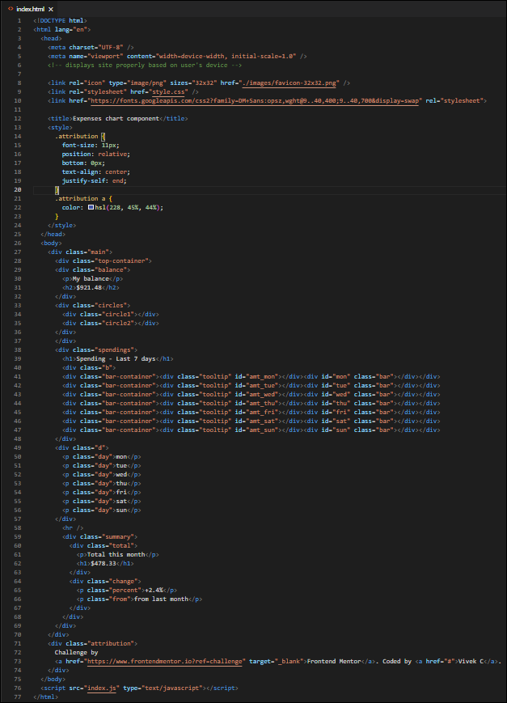
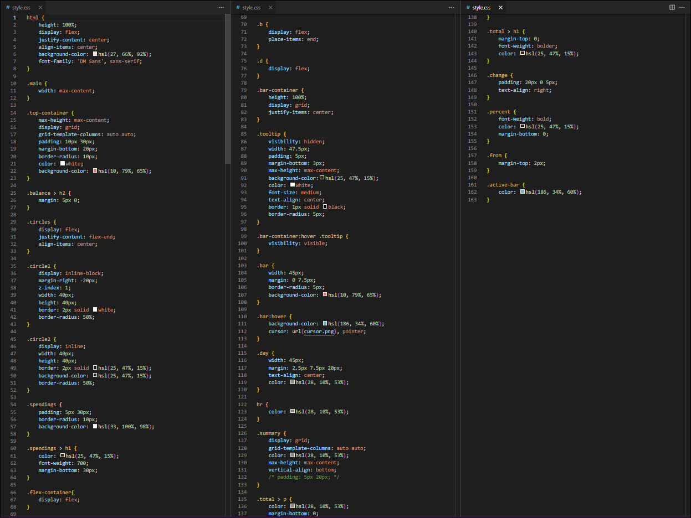
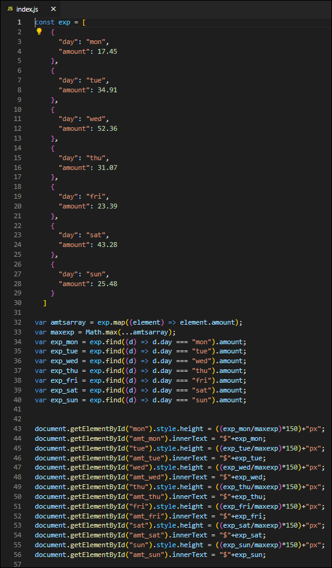

# Frontend Mentor - Expenses chart component solution

This is a solution to the [Expenses chart component challenge on Frontend Mentor](https://www.frontendmentor.io/challenges/expenses-chart-component-e7yJBUdjwt). Frontend Mentor challenges help you improve your coding skills by building realistic projects. 

## Table of contents

- [Overview](#overview)
  - [The challenge](#the-challenge)
  - [Screenshot](#screenshot)
  - [Links](#links)
- [My process](#my-process)
  - [Built with](#built-with)
  - [What I learned](#what-i-learned)
  - [Continued development](#continued-development)
  - [Useful resources](#useful-resources)
- [Author](#author)
- [Acknowledgments](#acknowledgments)

## Overview

### The challenge

Users should be able to:

- View the bar chart and hover over the individual bars to see the correct amounts for each day.
- View the optimal layout for the content depending on their device’s screen size.

### Screenshots

- *HTML :*

 - *CSS :*

 - *JS :*

### Links

- Solution URL: [My solution URL](https://your-solution-url.com)
- Live Site URL: [Add live site URL here](https://your-live-site-url.com)

## My process

### Built with

- Semantic HTML5 markup
- CSS custom properties
- Flexbox
- CSS Grid
- Mobile-first workflow

### What I learned

In this project I learned 2 new things :
 - 1. How to use CSS flex and grid properties.
 - 2. How to loop through object arrays in JS and access particular keys and it's values.

### Continued development

I am a newbie in Javascript but determined to learn more of this vast but amazing programming language. I want to have more indepth knowledge about objects and arrays in JS. Also, I want to understand how to import JSON data into a vanilla JS file.

### Useful resources

- [Markdownguide.org](https://www.markdownguide.org) - This helped me for wrinting this markdown.
- [W3Schools](https://www.w3schools.com) - A go-to-site for all our basic coding lessons and useful tips.

## Author

- Frontend Mentor - [@vickschap](https://www.frontendmentor.io/profile/vickschap)

## Acknowledgments

I would like to thank [Frontend Mentor](https://www.frontendmentor.io) for providing a platform to budding coders & developers to practice their skills on various real life challenges and gain new knowledge by interacting with other coders and mentors.
